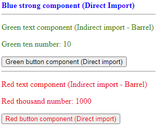
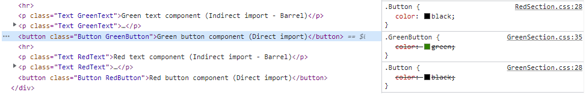
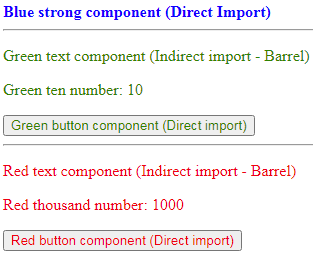
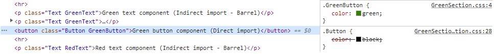
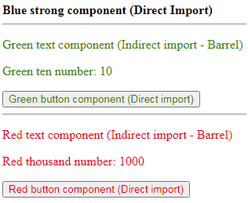
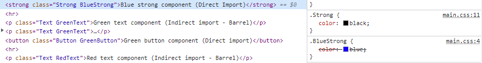
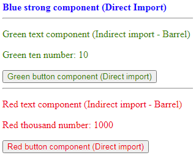
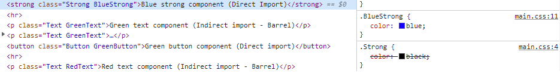
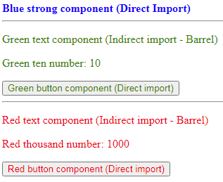

# Potential issues with barrel files in Webpack

## Table of Contents

- [Introduction](#introduction)
- [TL;DR](#tldr)
- [What are barrel files (index.js)?](#what-are-barrel-files-indexjs)
- [Barrel files in Webpack](#barrel-files-in-webpack)
  - [Optimization properties](#optimization-properties)
  - [Dynamic import (Lazy loading in React)](#dynamic-import-lazy-loading-in-react)
  - [Create a separate bundle file for common modules](#create-a-separate-bundle-file-for-common-modules)
  - [Manual configuration of `sideEffects` solution](#manual-configuration-of-sideeffects-solution)
  - [babel-plugin-transform-barrels](#babel-plugin-transform-barrels)
- [Function per module](#function-per-module)
- [Summary](#summary)

## Introduction

Barrel files make the development more convenient, but how do they impact the bundle files generated by Webpack?

In this article, we will discuss the question above. I will demonstrate how to configure Webpack to work with barrel files and dynamic import and how it's recommended to create modules. As incorrect config of Webpack can lead to different issues, some of them being performance issues as a result of unused code and others being visual issues.

We will examine several solutions and go through a process together to find the optimal solution.

This article assumes familiarity with optimization configuration of Webpack. Therefore, If you're new to this topic, I recommend reading my previous article on *Tree shaking in Webpack* before continuing reading this article.

## TL;DR
If you utilize barrel files with code splitting and employ regular CSS imports in your projects, I highly recommend using the `babel-plugin-transform-barrels` plugin instead of manually configuring `sideEffects`. This plugin will help prevent unexpected visual issues on your webpage and effectively reduce the size of your bundle files.

Furthermore, if code splitting is part of your development approach, I suggest creating modules with only one export each, whenever possible. This practice significantly decreases the size of your bundle files.

Additionally, for code splitting scenarios, I highly recommend leveraging the `splitChunks` configuration as explained in this article. This configuration allows for the elimination of duplicate code of common modules found in different chunks and will create a common chunk for common modules, resulting in optimized bundle files.

## What are barrel files (index.js)?
Before we dive into the issues and because most of them were caused by barrel files, I want to explain what barrel files are and their appropriate use cases. I will focus on the advantages, but you can learn more about their advantages and disadvantages in the *Additional Resources* section below.

A barrel is a file that re-exports other modules' exports into a single file. In my opinion, it is better to use one level of barrel files in the folder structure. It's not recommended to create a barrel file for every folder.

Developers use barrel files (index.js) for the following development purposes:
1. It makes the code more readable by shortening import path and decreasing the number of lines of code.
    ### Example
    *Without barrel files*
    ```javascript
    import { Button } from './components/Button/Button'
    import { Avatar } from './components/Avatar/Avatar'
    import { List } from './components/List/List'
    ```
    *With barrel files*
    ```javascript
    import { Button, Avatar, List } from './components'
    ```

2. When creating a third-party library and wanting to make specific functions public for consumers.
    
    The following quote from *yuchant* on [Github issue](https://github.com/vercel/next.js/issues/12557#issuecomment-1309240211) provides a good explanation:
    > Barrel files are effectively an API. A specific interface that distinguishes private vs public code.

3. Changes in the module's internal structure don't affect the library's consumers.

**Additional Resources:**

[Are TypeScript Barrel Files an Anti-pattern?](https://steven-lemon182.medium.com/are-typescript-barrel-files-an-anti-pattern-72a713004250)


## Barrel files in Webpack

After we have seen the advantages of using barrel files and how they improve our developer experience, now we will see their usage and how they affect the bundle files.
<br>
As we have already learned in the previous article about *Tree shaking in Webpack*, when there is no use of optimization, every module and its dependencies that exist in the code will be included in bundle files. So when we import a barrel file module, all the re-exported modules included inside it will be included in the bundle files, even modules that are not in use. This will increase the size of the bundle files and consequently harm performance.

### Optimization properties

Because barrel files can increase dramatically our bundle files size, we will use barrel files with `usedExports` and `sideEffects` optimization properties to eliminate unused code. Therefore in our example, modules in barrel files whose exports are not used will not be included in the final bundle files.

First, let's look at the main files of the example:

*[webpack.config.js](examples/1-optimization/webpack.config.js)*

```js
const MiniCssExtractPlugin = require("mini-css-extract-plugin");
//...
module.exports = {
  mode: "development",
  optimization: {
    usedExports: true,
    sideEffects: true,
  },
  module: {
    rules: [
      {
        test: /\.css$/,
        exclude: /node_modules/,
        use: [MiniCssExtractPlugin.loader, "css-loader"],
      },
      //...
    ]
  },
//...
}
```

*[App.js](examples/1-optimization/src/App.js)*

```jsx
import GreenSection from "./components/Sections/GreenSection/GreenSection";
import RedSection from "./components/Sections/RedSection/RedSection";
import { BlueStrong } from "./components/Strongs";

function App() {
  return (
    <>
      <BlueStrong>Blue strong component (Direct Import)</BlueStrong>
      <hr />
      <GreenSection />
      <hr />
      <RedSection />
    </>
  );
}

export default App;
```

*[GreenSection.js](examples/1-optimization/src/components/Sections/GreenSection/GreenSection.js)*

```jsx
import { GreenText } from "../../Texts";
import { GreenButton } from "../../Buttons/GreenButton/GreenButton";
import { getTenNumber } from "../../../tools/numberFunctions/numberFunctions";

function GreenSection() {
  const tenNum = getTenNumber();
  return (
    <>
      <GreenText>Green text component (Indirect import - Barrel)</GreenText>
      <GreenText>Green ten number: {tenNum}</GreenText>
      <GreenButton>Green button component (Direct import)</GreenButton>
    </>
  );
}

export default GreenSection;
```

*[RedSection.js](examples/1-optimization/src/components/Sections/RedSection/RedSection.js)*

```jsx
import { RedText } from "../../Texts";
import { RedButton } from "../../Buttons/RedButton/RedButton";
import { getThousandNumber } from "../../../tools/numberFunctions/numberFunctions";

function RedSection() {
  const thousandNum = getThousandNumber();
  return (
    <>
      <RedText>Red text component (Indirect import - Barrel)</RedText>
      <RedText>Red thousand number: {thousandNum}</RedText>
      <RedButton>Red button component (Direct import)</RedButton>
    </>
  );
}

export default RedSection;
```

Before we bundle our example, let's briefly review the code above and especially the imported modules.

Let's take a look at `App.js`, we can see that three components are in use: `BlueStrong`, `GreenSection` and `RedSection`.
<br>
`GreenSection.js` and `RedSection.js` modules are performing module imports according to the appropriate color from subdirectories of `Buttons` and `Texts`, as well as importing a module `numberFunctions.js`.
<br>
The only module that we will import indirectly from a barrel file will be from `Texts`. The remaining modules will be imported directly as we have always done.
<br>
Each appropriate module of color inside the subdirectories of `Buttons`, `Strongs` and `Texts` has imported also a CSS file for each.

After we did a short brief about how the code is implemented, we will describe in short what we expect to see in the rendered webpage. The first line should be in the blue color, 2-4 lines should be in green color and 5-7 lines should be in red color.

We can see in the `webpack.config.js` file, that there is a rule about CSS files that use the loader of `mini-css-extract-plugin`, so each time Webpack parse the CSS files it process the loader and will inject the content of the CSS files into chunk file. In our example it will be `main.css`.

During the bundling process, we expect that it will produce two files (JS and CSS files).
<br>
Now run `npx webpack` in the terminal window.
<br>
The build process created two files as expected: `main.js` and `main.css`.

Let's take a look at the browser and check the rendered page:


The page was rendered as expected.

Now let's analyze the bundle files.

It would be easier to understand if we organized all bundle files in a table according to the following columns:
1. Bundle file name.
2. List of modules that combined to the bundle file. It's after `sideEffects` optimization effect.
3. The included functions (Actual) inside the bundle file. It's after `usedExports` optimization effect.
4. The functions that the bundle file should include (Expected) for the most optimized desired bundle file.

**Javascript bundle files**

| Bundle file |                                                                                        Bundled modules                                                                                       |                                                                     Actual functions                                                                     |                                                                    Expected functions                                                                    |
|:-----------:|:--------------------------------------------------------------------------------------------------------------------------------------------------------------------------------------------:|:--------------------------------------------------------------------------------------------------------------------------------------------------------:|:--------------------------------------------------------------------------------------------------------------------------------------------------------:|
|   main.js   | App.js, Button.js, GreenButton.js,<br>RedButton.js, GreenSection.js, RedSection.js,<br>BlueStrong.js, Strong.js, Texts/index.js,<br>GreenText.js, RedText.js, Text.js,<br>numberFunctions.js | App, Button, GreenButton,<br>RedButton, GreenSection, RedSection,<br>BlueStrong, Strong, GreenText,<br>RedText, Text, getTenNumber,<br>getThousandNumber | App, Button, GreenButton,<br>RedButton, GreenSection, RedSection,<br>BlueStrong, Strong, GreenText,<br>RedText, Text, getTenNumber,<br>getThousandNumber |

Let's take a look in the JS bundle file:

*[main.js](examples/1-optimization/dist/main.js)*

```javascript
//...
/* unused harmony export getHundredNumber */
function getTenNumber() {
  return 10;
}
function getHundredNumber() {
  return 100;
}
function getThousandNumber() {
  return 1000;
}
//...
```


In the [main.js](examples/1-optimization/dist/main.js) file, we can see that Webpack bundled all the used functions, including the unused `getHundredNumber` function, which is marked as an `unused harmony export` by the `usedExports` property. Note that the `RedText` component is imported from `"Texts/index.js"`, which is a barrel file, so all re-exported modules of the barrel file should be included, such as the `BlueText` module. But because we use the `sideEffects` property and the `BlueText` module is not used and doesn't have side effects, it is excluded from the bundled file.

Let's analyze the CSS bundle files:

**CSS bundle files**

| **Bundle file** |                                      **Actual classes**                                      |                                **Expected classes**                                |
|:---------------:|:--------------------------------------------------------------------------------------------:|:----------------------------------------------------------------------------------:|
|     main.css    | Text, RedText, BlueText, GreenText,<br>Button, GreenButton, RedButton,<br>Strong, BlueStrong | Text, RedText, GreenText, Button,<br>GreenButton, RedButton, Strong,<br>BlueStrong |

In the [main.css](examples/1-optimization/dist/main.css) file, we can see an unused class selector for `.BlueText` because we imported a [barrel file module](examples/1-optimization/src/components/Texts/index.js) that includes the unused `BlueText` module. While the `BlueText` module was being evaluated, the `BlueText.css` file was extracted by the `mini-css-extract-plugin` plugin and added to the `main.css` file. Afterwards, `BlueText` was eliminated from `main.js` due to the `sideEffects: true` property. We will continue to monitor this unnecessary CSS selector. Note that unnecessary CSS selectors only come from unused modules that are re-exported in used barrel files. For example, there is no `.BlueButton` CSS selector because `GreenButton` and `RedButton` are directly imported rather than through a barrel file.

So we have an issue that we want to solve: we don't want the unnecessary `.BlueText` CSS selector and we want our JS and CSS to be as small as possible.

#### We have two ways to solve it:
1. Change the imports of the `GreenText` and `RedText` to be direct imports instead of indirect imports (`index.js` - barrel file), so this will prevent the `BlueText` module and its CSS file from being loaded. This is similar to why the `.BlueButton` CSS selector is not present in the CSS file because `GreenButton` and `RedButton` are directly imported.
2. Since the `BlueText.js` module has an unused export and our project only has side effects in CSS files, we can manually define which modules have side effects using the config option `sideEffects: ["*.css"]` and then the remaining modules with unused exports like `BlueText.js` will be flagged as having no side effects. This will prevent evaluation of the `BlueText.js` module and extraction of its CSS file content through the loader.

### Dynamic import (Lazy loading in React)

After we saw that using barrel files can cause unused CSS files content to be included in CSS bundle file and we disscused the optional solutions, now I want to check the using barrel files inside a module that dynamically imported.

Dynamic import of a module is usually used when we want to load the module in specific conditions (inside `if` statement or event handler). If these conditions are not met, the code inside this module will not be evaluated, so we don't really need to download this module while the conditions are not met. So here Webpack comes to help. Webpack will create a bundle file for each module that is dynamically imported and for its dependencies and only download and evaluate this module when the conditions are met.

For example, in React there is a package named `react-router-dom` that allows render specific components for a specific URL path and render different components for a different URL path. In this case, it's recommended to use in lazy loading to make the components' modules downloaded from the server only when they are used. To make it happen, Webpack will create a new bundle file for each lazy loaded module with its dependencies.

As described in [Webpack website](https://webpack.js.org/api/module-methods/#import-1):

> Dynamically load modules. Calls to import() are treated as split points, meaning the requested module and its children are split out into a separate chunk.

Dynamic import in Webpack is important for improving performance of initial loading because it allows us to only download and evaluate what is needed on each webpage. This means we can include in the bundle file only the necessary modules for the initial loading and as a result make smaller bundle file that then make our webpage load faster.

For our example, and to keep it simple, we will change only the imports of `RedSection.js` and `GreenSection.js` to be dynamic imports without conditionally use them so both of them always will be downloaded in the initial loading of the webpage. We expect that Webpack will create three JS bundle files instead one.

As we remember, `RedSection.js` and `GreenSection.js` modules have two direct common modules: `Texts/index.js` and `numberFunctions.js` that uses different functions inside them. How webpack will handle it? Are the common modules will be included only in both bundle files? Or maybe only in the main bundle file? Or maybe a fourth bundle file will be created for common modules? The answer we will see after the bundling process of the example.

Let's create an example and see the files it produces.

Clone the previous `1-optimization-sideEffects` example into a new `2-lazy-loading` example and make the following changes to the `App.js` file:

*[App.js](examples/1-lazy-loading/App.js)*

  ```diff
- import GreenSection from "./components/Sections/GreenSection/GreenSection";
- import RedSection from "./components/Sections/RedSection/RedSection";
  import { BlueStrong } from "./components/Strongs/BlueStrong/BlueStrong";
+ import { lazy, Suspense } from "react";

+ const GreenSection = lazy(() => import(/* webpackChunkName: 'GreenSection' */ "./components/Sections/GreenSection/GreenSection"));
+ const RedSection = lazy(() => import(/* webpackChunkName: 'RedSection' */ "./components/Sections/RedSection/RedSection"));

  function App() {
    return (
      <>
+       <Suspense fallback={<></>}>
            <BlueStrong>Blue strong component (Direct Import)</BlueStrong>
            <hr />
            <GreenSection />
            <hr />
            <RedSection />
+       </Suspense>
      </>
    );
  }

  export default App;
  ```

Now run `npx webpack` in the terminal window.
<br>
This produces the following files:
1. `main.js` and `main.css`.
2. `GreenSection.js` and `GreenSection.css` - *New files*.
3. `RedSection.js` and `RedSection.css` - *New files*.

Let's take a look at the rendered page in the browser:



We see that the *Green button component (direct import)*, which is part of the `GreenSection`, has turned black instead of being green. Why did this happen?

First, let's take a look at the DevTools:



We can see that the `.Button` CSS selector appears twice. The `GreenSection.css` file loads both `.Button` and `.GreenButton`, but then `.Button` is loaded again but from the `RedSection.css` file. Loading the `.Button` CSS selector only once from `GreenSection.css` file will solve this problem. This happens because the `Button.js` module loaded twice instead of once, causing it to override the green color with black. The order in which CSS properties (in our case `color`) are applied is determined by their order of loading, where properties from class selectors loaded later will override those from earlier class selectors.

Now let's analyze our bundle files.

It would be easier to understand if we organized all bundle files in a table according to the following columns:
1. Bundle file name.
2. List of modules that combined to the bundle file. It's after `sideEffects` optimization effect.
3. The included functions (Actual) inside the bundle file. It's after `usedExports` optimization effect.
4. The functions that the bundle file should include (Expected) for the most optimized desired bundle file.

**Javascript bundle files**

| **Bundle file** |                                                   **Bundled modules**                                                   |                                        **Actual functions**                                        |                 **Expected functions**                |
|:---------------:|:-----------------------------------------------------------------------------------------------------------------------:|:--------------------------------------------------------------------------------------------------:|:-----------------------------------------------------:|
|     main.js     | App.js, BlueStrong.js, Strong.js                                                                                        | BlueStrong, Strong                                                                                 | BlueStrong, Strong                                    |
| GreenSection.js | Button.js, GreenButton.js, GreenSection.js,<br>GreenText.js, RedText.js, Text.js,<br>Texts/index.js, numberFunctions.js | Button, GreenButton, GreenSection,<br>GreenText, RedText, Text,<br>getTenNumber, getThousandNumber | GreenText, GreenButton, GreenSection,<br>getTenNumber |
|  RedSection.js  | Button.js, RedButton.js, RedSection.js,<br>GreenText.js, RedText.js, Text.js,<br>Texts/index.js, numberFunctions.js     | Button, RedButton, RedSection, GreenText,<br>RedText, Text, getTenNumber,<br>getThousandNumber     | RedText, RedButton, RedSection,<br>getThousandNumber  |
|    *common.js   |                                                                                                                         |                                                                                                    | Text, Button                                          |

**Note: The `common.js` is not produced by the build process. It's my suggestion for a bundle file for functions that are used by more than one JS bundle file.**

**Explanation of JS bundle files**

1. First, we will check in what bundle files the common modules `Texts/index.js` and `numberFunctions.js` of [GreenSection.js](examples/2-lazy-loading/src/components/Sections/GreenSection/GreenSection.js) and [RedSection.js](examples/2-lazy-loading/src/components/Sections/RedSection/RedSection.js) source files are included. It can be seen in the table above that they are included inside `RedSection.js` and `GreenSection.js` bundle files. We expected that the `usedExports` and `sideEffects` optimization properties would eliminate the unused code separately in each `RedSection.js` and `GreenSection.js` bundle files. Unfortunately Webpack doesn't do that. We can see in both bundle files that the content of the imported modules are the same to the first example where only `BlueText.js` module and `getHundredNumber` function are eliminated. Unfortunately, the `usedExports` and `sideEffects` optimizations performed on the entire code are the same as in the first example without dynamic imports. Therefore, the `RedSection.js` bundle file will include also the unused `GreenText.js` module and `getTenNumber` function and the `GreenSection.js` bundle file will include also the unused `RedText.js` module and `getThousandNumber` function. <br>
The `Texts/index.js` and `numberFunctions.js` modules have different solutions. <br>
For `Texts/index.js`, we can use the [same solution](#we-have-two-ways-to-solve-it) I suggested in the first example. <br>
For `numberFunctions.js`, we can use the solution of separating the module to 3 different modules that each one will have one function and then import the function from his specific module.
2. In addition, `Text.js` and `Button.js` are indirectly common modules imported from `Texts/index.js`, `GreenButton.js` and `RedButton.js` modules. Therefore, `Text.js` and `Button.js` modules content appear in both `GreenSection.js` and `RedSection.js` bundle files that uses the same functions (`Text` and `Button` functions). This results a duplicate code, and our goal is to reduce their size. <br>
To solve this issue, we should try creating a separate bundle file for common modules which have the same used functions of both sections. Since `Text.js` and `Button.js` are modules with one function each, we can conclude that both sections are using the same functions from these modules.

Let's analyze the CSS bundle files. <br>

**CSS bundle files**

|  **Bundle file** |                     **Actual classes**                     |  **Expected classes**  |
|:----------------:|:----------------------------------------------------------:|:----------------------:|
|     main.css     | BlueStrong, Strong                                         | BlueStrong, Strong     |
| GreenSection.css | Text, RedText, BlueText, GreenText,<br>Button, GreenButton | GreenText, GreenButton |
|  RedSection.css  | Text, RedText, BlueText, GreenText,<br>Button, RedButton   | RedText, RedButton     |
|    common.css    |                                                            | Text, Button           |

**Explanation of CSS bundle files:**
1. The `main.css` file has class selectors for `.Strong` and `.BlueStrong` because we use the `BlueStrong` component in the `App.js` file and it works as expected.
2. In the CSS bundle files of `GreenSection.css` and `RedSection.css` modules, we can see that the `.BlueText` CSS class selector appears even when the `BlueText` component isn't used. We already talked about the reason why it happened in the first example and that there are [two ways to solve it](#we-have-two-ways-to-solve-it) and we will try these options later.
3. The `.GreenText` appears in `RedSection.css` and `.RedText` appears in `GreenSection.css`, even though both of them aren't useful and need to be eliminated. It happened because their modules (`GreenText.js` and `RedText.js`) are imported from the barrel file of `Texts/index.js`. Later we will see if the solution for `.BlueText` will help us solve this issue as well.

Let's summarize the issues for the example of lazy loading:

1. *Green button component (direct import)* button has a black color instead green.
2. `getTenNumber` and `getThousandNumber` functions exist in both `GreenSection.js` and `RedSection.js` bundle files instead, `getTenNumber` should only be included in `GreenSection.js` and `getThousandNumber` should only be included in `RedSection.js`. The same applies to the unused `RedText` in the `GreenSection.js` bundle file and the unused `GreenText` in the `RedSection.js` bundle file. Why did this happen? Because the optimizations of `usedExports` and `sideEffects` occurred to the entire code and not separately to each bundle file.
3. `Text.js` and `Button.js` modules appear in two bundle files of `GreenSection.js` and `RedSection.js` instead of in one common bundle file for both sections.
4. `.BlueText` exists in both bundle CSS files even though it is unused. `.RedText` should be eliminated from `GreenSection.css` bundle file and `.GreenText` should be eliminated from `RedSection.css` bundle file.

Splitting bundle files can cause new issues. Some of these issues can affect performance, while others can cause unexpected visual issues that are more critical because they affect the user experience. So first, let's try to fix style issues and unnecessary duplicate code by using the optimization configuration of the `splitChunks` property. After that, we will address unused functions and CSS selectors to decrease the size of bundle files.

### Create a separate bundle file for common modules

In the previous chapter on dynamic import, we saw that each dynamic import in Webpack produces JS and CSS bundle files. In addition, commonly used modules exist in all bundle files that use these modules. As a result, there are CSS classes that are loaded twice and also duplicate Javascript code. This behavior causes four issues, one of which is an unexpected visual issue.

To address this, we can use the `splitChunks` property to create a bundle file of common modules.

Let's clone the previous example `2-lazy-loading` to `3-splitChunks` and change the Webpack config file as follows:

_[webpack.config.js](examples/3-splitChunks/webpack.config.js)_

```diff
//...
module.exports = {
  mode: "development",
  optimization: {
    usedExports: true,
    sideEffects: true,
+   splitChunks: {
+     cacheGroups: {
+       default: false,
+       defaultVendors: false,
+       src: {
+	  test: /[\\/]src[\\/]/,
+	  minSize: 0,
+	  priority: 100,
+	  name: (module, chunks) => {
+	    const allChunksNames = chunks.map(({ name }) => name).join(".");
+	    return `${allChunksNames}`;
+	  },
+	  chunks: "all",
+	},
+     },
+   },
  },
//...
}
```

Let's briefly explain what `splitChunks` is doing with the configuration above. It traverses each module that includes the `src` directory in its path and assigns a bundle file name to each traversed module through the `name` property. The bundle file name of the traversed module will be the name of the chunk names (`webpackChunkName` magic comment inside `import()` statement) of dynamically imported modules that include this traversed module. For example the module `numberFunctions.js` is included in `GreenSection.js` and `RedSection.js` source files that are dynamically imported, so the bundle file name that the module `numberFunctions.js` should be inside is `GreenSection.RedSection.js`.

I think my configuration above is better than the configuration described in the article [*webpack 4: Code Splitting, chunk graph and the splitChunks optimization*](https://medium.com/webpack/webpack-4-code-splitting-chunk-graph-and-the-splitchunks-optimization-be739a861366) because I control the name of the bundle files to be the name of the dynamically imported modules.

Now run `npx webpack` in the terminal window.
<br>
It produces the following files:
1. `main.js` and `main.css`.
2. `GreenSection.js` and `GreenSection.css`.
3. `RedSection.js` and `RedSection.css`.
4. `GreenSection.RedSection.js` and `GreenSection.RedSection.css` - *New files*.

In comparison to the previous example `2-lazy-loading`, it generated `GreenSection.RedSection.js` and `GreenSection.RedSection.css` bundle files in addition.

Now let's take a look in the browser and check the rendered page:



We see that the *Green button component (direct import)* is rendered with the green color as expected.

Let's inspect the `button` element:



We can see that the `.Button` CSS selector now appears only once in the common bundle file `GreenSection.RedSection.css`, so with the `splitChunks` property, we have finally solved this visual issue.

Let's analyze the bundle files:

**Javascript bundle files**

|       **Bundle file**      |                                  **Bundled modules**                                  |                           **Actual functions**                          |                 **Expected functions**                |
|:--------------------------:|:-------------------------------------------------------------------------------------:|:-----------------------------------------------------------------------:|:-----------------------------------------------------:|
|           main.js          | App.js, BlueStrong.js, Strong.js                                                      | BlueStrong, Strong                                                      | BlueStrong, Strong                                    |
|       GreenSection.js      | GreenButton.js, GreenSection.js                                                       | GreenButton, GreenSection                                               | GreenText, GreenButton, GreenSection,<br>getTenNumber |
|        RedSection.js       | RedButton.js, RedSection.js                                                           | RedButton, RedSection                                                   | RedText, RedButton, RedSection,<br>getThousandNumber  |
| GreenSection.RedSection.js | Button.js, GreenText.js, RedText.js,<br>Text.js, Texts/index.js,<br>numberFuntions.js | Button, GreenText, RedText,<br>Text, getTenNumber,<br>getThousandNumber | Text, Button                                          |

**Explanation of JS bundle files**

1. If we take a look at the file [GreenSection.RedSection.js](examples/3-splitChunks/dist/GreenSection.RedSection.js), we can see that commonly used modules of the `GreenSection.js` and `RedSection.js` modules are included, such as the `Button.js` and `Text.js` modules, as expected. So we have solved this issue. <br>
   Note: The `Button.js` and `Text.js` modules are indirectly imported modules through `RedText.js`, `GreenText.js`, `GreenButton.js` and `RedButton.js` modules.
2. The bundle file [GreenSection.RedSection.js](examples/3-splitChunks/dist/GreenSection.RedSection.js) also includes the `GreenText`, `RedText`, `getTenNumber`, and `getThousandNumber` functions. These functions should not be in this common bundle file and they are part of the common bundle file because Webpack splits bundle files according to their used common module and not used common function. According to our case, the `GreenSection.js` and `RedSection.js` modules import the same modules `Texts/index.js` and `numberFunctions.js`, so these modules and their dependencies are included in the common bundle module `GreenSection.RedSection.js`. <br>
   The desired result we wantis that `GreenText` and `getTenNumber` should be in the `GreenSection.js` bundle file and `RedText` and `getThousandNumber` should be in the `RedSection.js` bundle file.

Let's analyze the CSS bundle files.

**CSS bundle files**

|       **Bundle file**       |             **Actual classes**             |  **Expected classes**  |
|:---------------------------:|:------------------------------------------:|:----------------------:|
|           main.css          | BlueStrong, Strong                         | BlueStrong, Strong     |
|       GreenSection.css      | GreenButton                                | GreenText, GreenButton |
|        RedSection.css       | RedButton                                  | RedText, RedButton     |
| GreenSection.RedSection.css | Text, RedText, BlueText, GreenText, Button | Text, Button           |

**Explanation of CSS bundle files:**
1. `.BlueText` is included in `GreenSection.RedSection.css` even though it is unused. This happened because we import a barrel file of `Texts/index.js` that first loads the re-exported modules and while evaluating these modules it extracted CSS contents by the CSS loader and then eliminates unused code. It happened for the same reason as in the first example.
2. `.RedText` and `.GreenText` are included in `GreenSection.RedSection.css`, when they should included in `RedSection.css` and `GreenSection.css`, respectively. This happened for the same reason as we mentioned about their JS files, that they are indirectly imported through a barrel file. Webpack creates a common bundle file because the common module of `Text/index.js` is imported in both `GreenSection.js` and in `RedSection.js`.

Let's summarize the current opened issues:

**Summary of Javascript issues:**

1. `GreenText` and `RedText` modules are included in the common bundle file `GreenSection.RedSection.js` instead in their specific bundle files `GreenSection.js` and `RedSection.js`, respectively. Because they are imported indirectly through a barrel file `Texts/index.js` that it is the common module. If we will want to render one section file instead of the two sections, then we will download unused code. For example, if we load a page that renders only `GreenSection` component but conditionally renders `RedSection` component, then the downloaded bundle will include `RedText.js` even though we don't need it now.
2. `GreenSection.RedSection.js` bundle file include `getTenNumber` and `getThousandNumber` functions instead `GreenSection.js` bundle file include only `getTenNumber` and `RedSection.js` bundle file include only `getThousandNumber`.

**Summary of CSS issues:**
1. `.BlueText` exist in common bundle CSS `GreenSection.RedSection.css` even it is unused.
2. `.RedText` and `.GreenText` shouldn't be in `GreenSection.RedSection.css` bundle file. They should be in `RedSection.css` and `GreenSection.css`, respectively. The behavior of `.RedText` and `.GreenText` happened because the using of barrel file.

**Our conclusions for now:**
1. Using direct import instead of indirect import (barrel files) solves most of the issues.
2. Using one function per module instead of multiple functions per module solves the issues of the `numberFunctions` module.

### Manual configuration of `sideEffects` solution

One of our conclusions in the previous example was that the use of barrel files can cause issues when dynamic import is used. It seems that `usedExports` marks unused exports for the whole code as a one bundle file only and not for each separate bundle file. When we made direct imports with the `GreenButton` and `RedButton` components, it worked properly.

In my *Tree shaking in Webpack* article, we learned that we can manually configure which modules in our project have side effects and which don't.
<br>
Also from that article, we know for sure that CSS files are considered to have side effects, so we need to flag them with side effects. Barrel files in our case only have re-exported functions, so we can say that we don't use direct imports from barrel files and they also don't have side effects, so we can flag barrel files without side effects.

Webpack's team talked about the purpose of the manual `sideEffects` property in their [conference](https://youtu.be/bm7RlNEcQM0?t=1761) and explained that it comes to solve the issue of big bundle files when using of barrel files.

So let's try to solve our issues from the previous example with a manual configuration of `sideEffects` in `package.json`.

Let's clone the previous example `3-splitChunks` to `4-package-sideEffects` and change the package config file as follows:

_[package.json](examples/4-package-sideEffects/package.json)_

```diff
{
  "name": "example-module",
+ "sideEffects": ["*.css"],
}
```

Now run `npx webpack` in the terminal window.

Let's take a look in the browser and check the rendered page:



We see that the *Blue strong component (Direct Import)* text is black when it should be blue. This is a visual issue. Why did this strange behavior occur?

First, let's look at the dev tools:



We can see that `.Strong` overrides `.BlueStrong` because `.Strong` is in a higher position. Why did this change? In the previous examples, `.BlueStrong` overrode `.Strong`. This happened because of the `sideEffects` property.

So I started to research this issue.

I found an [issue](https://github.com/webpack/webpack/issues/10413) where *Hypnosphi* complained that there were differences between development and production when he configured `sideEffects: false`, so he noticed that the order of CSS was not the order of the imports but the usage order. In another [issue](https://github.com/webpack/webpack/issues/7094#issuecomment-383466978), there is an answer from *sokra* (a Webpack team member) who wrote:
> Technically using sideEffects you say order doesn't matter

Another answer from [sokra](https://github.com/webpack/webpack/issues/7094#issuecomment-945663737):
> If the order of some modules matter they are not side-effect-free.

So let's go back to our case.

We evaluate the `BlueStrong.js` module that first imports the `Strong` component and then `BlueStrong.css`. But because we flagged modules with sideEffects manually, Webpack will first evaluate import module statements flagged with side effects and then evaluate used modules flagged without side effects in the order of their use. So the import of `BlueStrong.css` will be evaluated first and then we use the `Strong.js` that will be evaluated with `Strong.css` inside of it.

**Let's analyze bundle files:**

**Javascript bundle files**

|       **Bundle file**      |                **Bundled modules**               |                    **Actual functions**                    |                      **Expected functions**                     |
|:--------------------------:|:------------------------------------------------:|:------------------------------------------------:|:-----------------------------------------------------:|
|           main.js          | App.js, BlueStrong.js, Strong.js                 | BlueStrong, Strong                               | BlueStrong, Strong                                    |
|       GreenSection.js      | GreenButton.js, GreenSection.js,<br>GreenText.js | GreenButton, GreenSection, GreenText             | GreenText, GreenButton, GreenSection,<br>getTenNumber |
|        RedSection.js       | RedButton.js, RedSection.js,<br>RedText.js       | RedButton, RedSection, RedText                   | RedText, RedButton, RedSection,<br>getThousandNumber  |
| GreenSection.RedSection.js | Button.js, Text.js,<br>numberFunctions.js        | Button, Text, getTenNumber,<br>getThousandNumber | Text, Button                                          |

**CSS bundle files**

|       **Bundle file**       |   **Actual classes**   |  **Expected classes**  |
|:---------------------------:|:----------------------:|:----------------------:|
|           main.css          | BlueStrong, Strong     | BlueStrong, Strong     |
|       GreenSection.css      | GreenText, GreenButton | GreenText, GreenButton |
|        RedSection.css       | RedText, RedButton     | RedText, RedButton     |
| GreenSection.RedSection.css | Text, Button           | Text, Button           |

In the CSS table above, we can see for the first time that CSS files have the expected class selectors. So for now, we know for sure that the size of the CSS files is as small as possible.

Let's check if our previous example issues are solved:
1. `GreenText` and `RedText` are in their correct bundle files `GreenSection.js` and `RedSection.js`, respectively. `sideEffects` solved the issue of imported modules from barrel files.
2. `.BlueText`, which previously existed in the common bundle CSS file `GreenSection.RedSection.css` even though it was unused, is now eliminated. `.RedText` and `.GreenText` are in `RedSection.css` and `GreenSection.css`, respectively. `sideEffects` solved the issue caused by the barrel file.
3. `getTenNumber` and `getThousandNumber` still exist in the `GreenSection.RedSection.js` bundle file instead of `getTenNumber` being only inside `GreenSection.js` and `getThousandNumber` being only inside `RedSection.js`.

Let's summarize the current open issues:

1. `getTenNumber` and `getThousandNumber` still exist in the `GreenSection.RedSection.js` bundle file, instead of having only `getTenNumber` in `GreenSection.js` and only `getThousandNumber` in `RedSection.js`.
2. `.Strong` overrides `.BlueStrong` when it should be the opposite. This is a result of the `sideEffects: ["*.css"]` configuration that changing the order of imports based on usage of a module rather than by the order of import statements (except for CSS imports). This causes a visual issue.

I have considered several solutions for the second issue:
1. Convert CSS files to [CSS Modules](https://github.com/css-modules/css-modules) and change the `sideEffects: ["*.css"]` configuration to `sideEffects: false`.
2. Create a plugin that moves all CSS import statements to the end of the module if `sideEffects: ["*.css"]` is defined in `package.json`. 
3. Change import statements from indirect imports through a barrel file to direct imports.

All of these solutions should work, but the first two solutions with configuration of `sideEffects` in `package.json` will change the import order to be determined by usage. The third solution, on the other hand, follows the order of import statements as ES Modules behavior. Since I want to follow my principle of having the bundle file resemble ES Modules behavior, the third solution is the better choice.

We still want to use barrel files because they make our code more readable and improve our developer experience. In the next chapter, we will try to develop an automatic transformation for our code that changes indirect imports through a barrel file to direct imports.

### babel-plugin-transform-barrels

I know that Babel can transform code during the build process of Webpack. So I found some plugins ([#1](https://github.com/mui/material-ui/blob/871c2f35009977d29f9ce735075eaefe0f5fc824/docs/src/pages/guides/minimizing-bundle-size.md#option-2), [#2](https://github.com/LiamMartens/babel-plugin-no-index-imports), [#3](https://github.com/SectorLabs/babel-plugin-transform-named-imports)) that will transform the import statements from indirect import (through barrel file) to direct import, but all of them require specific configuration for each package. So I decided to develop a Babel plugin that will transform code with imports from barrel files into code with direct imports without needing configuration.

Kent C. Dodds talked about the problem of unnecessary CSS class selectors in this [video](https://www.youtube.com/watch?v=Q_F-c0LEp4I) and about his [solution](https://www.youtube.com/watch?v=EkhD1OMHkYI). It is based on a plugin that requires specific configuration, something that I don't want.

During the bundling process, my babel plugin transforms the line of code as follows:

From an indirect import (barrel file):

```javascript
import { RedText } from "../../Texts";
```

To a direct import:

```javascript
import { RedText } from '../../Texts/RedText/RedText';
```

My babel plugin prevents the inclusion of unused reexported modules from barrel files in the bundle file. This leads to a reduction in bundle size, thereby improving overall performance.

Now, let's install the plugin:

`npm install --save-dev babel-plugin-transform-barrels`

Now we need to add the plugin to the webpack config file which has a rule with a loader of `babel-loader`:

_[webpack.config.js](examples/5-babel-plugin/webpack.config.js)_

```diff
      {
        test: /\.(js|mjs|jsx|ts|tsx)$/,
        exclude: /node_modules/,
        loader: require.resolve("babel-loader"),
        options: {
          presets: [["@babel/preset-react"]],
+         plugins: [["transform-barrels", { webpackConfigFilename: __filename, ...(typeof module.exports === "function" && { args: arguments })}]],
        },
      },
```

Now run `npx webpack` in the terminal window.

Let's take a look in the browser and check the rendered page:



We see that the "Blue strong component (Direct Import)" has the blue color as expected.

Let's look at the dev tools:



So even though the CSS table in this example is the same as in the previous example, the rendered page is different because now class selectors are loaded in the order of their import statements, as expected, rather than in the order of their usage.

We can see that `.BlueStrong` overrides `.Strong`, so this issue is solved.

**Let's analyze bundle files:**

**Javascript bundle files**

|       **Bundle file**      |                **Bundled modules**               |               **Actual functions**               |                 **Expected functions**                |
|:--------------------------:|:------------------------------------------------:|:------------------------------------------------:|:-----------------------------------------------------:|
|           main.js          | App.js, BlueStrong.js, Strong.js                 | BlueStrong, Strong                               | BlueStrong, Strong                                    |
|       GreenSection.js      | GreenButton.js, GreenSection.js,<br>GreenText.js | GreenButton, GreenSection, GreenText             | GreenText, GreenButton, GreenSection,<br>getTenNumber |
|        RedSection.js       | RedButton.js, RedSection.js,<br>RedText.js       | RedButton, RedSection, RedText                   | RedText, RedButton, RedSection,<br>getThousandNumber  |
| GreenSection.RedSection.js | Button.js, Text.js,<br>numberFunctions.js        | Button, Text, getTenNumber,<br>getThousandNumber | Text, Button                                          |

**CSS bundle files**

|       **Bundle file**       |   **Actual classes**   |  **Expected classes**  |
|:---------------------------:|:----------------------:|:----------------------:|
|           main.css          | BlueStrong, Strong     | BlueStrong, Strong     |
|       GreenSection.css      | GreenText, GreenButton | GreenText, GreenButton |
|        RedSection.css       | RedText, RedButton     | RedText, RedButton     |
| GreenSection.RedSection.css | Text, Button           | Text, Button           |

As we can see in the Javascript and CSS tables above, there is no difference compared to the previous example `4-package-sideEffects`.

Let's summarize the current open issues:

1. `getTenNumber` and `getThousandNumber` still exist in the `GreenSection.RedSection.js` bundle file instead of `getTenNumber` being only included in `GreenSection.js` and `getThousandNumber` being only included in `RedSection.js`.

The `numberFunctions.js` module has 3 function exports. If we split the module into 3 separate modules, each with one function export, it should resolve the issue.

### Function per module

Before I try my optional solution, I searched for open issues on Webpack's Github repository and found the same [issue](https://github.com/webpack/webpack/issues/16672) we faced, but there is no solution provided by the Webpack team.

I checked a popular package with tree shaking support called [Lodash](https://github.com/lodash/lodash). Lodash has a separate module per function. This allows the package to fully support tree shaking.

We will try this approach and see if it resolves our issue from the previous example.

Let's clone the previous example `5-babel-plugin` to `6-function-per-module`.

Now let's split the exports `getTenNumber`, `getHundredNumber`, and `getThousandNumber` from `src\tools\numberFunctions\numberFunctions.js` into 3 modules: `getTenNumber.js`, `getHundredNumber.js`, and `getThousandNumber.js`, respectively. And create a barrel file for the `src\tools\numberFunctions` directory. Now change the import statements of these functions in the `GreenSection.js` and `RedSection.js` modules.

Now run `npx webpack` in the terminal window.

Let's take a look in the browser and check the rendered page:



Everything looks great in our rendered page.

**Let's analyze bundle files:**

**Javascript bundle files**

|       **Bundle file**      |                        **Bundled modules**                        |                  **Actual functions**                 |                 **Expected functions**                |
|:--------------------------:|:-----------------------------------------------------------------:|:-----------------------------------------------------:|:-----------------------------------------------------:|
|           main.js          | App.js, BlueStrong.js, Strong.js                                  | BlueStrong, Strong                                    | BlueStrong, Strong                                    |
|       GreenSection.js      | GreenButton.js, GreenSection.js,<br>GreenText.js, getTenNumber.js | GreenText, GreenButton, GreenSection,<br>getTenNumber | GreenText, GreenButton, GreenSection,<br>getTenNumber |
|        RedSection.js       | RedButton.js, RedSection.js,<br>RedText.js, getThousandNumber.js  | RedText, RedButton, RedSection,<br>getThousandNumber  | RedText, RedButton, RedSection,<br>getThousandNumber  |
| GreenSection.RedSection.js | Button.js, Text.js                                                | Text, Button                                          | Text, Button                                          |

**CSS bundle files**

|       **Bundle file**       |   **Actual classes**   |  **Expected classes**  |
|:---------------------------:|:----------------------:|:----------------------:|
|           main.css          | BlueStrong, Strong     | BlueStrong, Strong     |
|       GreenSection.css      | GreenText, GreenButton | GreenText, GreenButton |
|        RedSection.css       | RedText, RedButton     | RedText, RedButton     |
| GreenSection.RedSection.css | Text, Button           | Text, Button           |

Now `getTenNumber` and `getThousandNumber` no longer included in the `GreenSection.RedSection.js` bundle file. Instead, `getTenNumber` is included only in `GreenSection.js` and `getThousandNumber` is included only in `RedSection.js`.

We have successfully overcome all of our performance and visual issues. Now our project is optimized. We managed to minimize the size of the project by reducing the amount of CSS and Javascript code. The project only loads what it needs.

## Summary

In this article, we encountered inefficient bundle files and visual issues in the browser when using barrel files with dynamic import that caused our bundle files to split into different chunks with unused Javascript code. We conducted a step-by-step examination to determine the best way to solve these issues.

We found 2 particular reasons for the issues:
1. Using barrel files in our code.
2. Using a module with more than one export.

The issues occurred because `usedExports` and `sideEffects` optimizations performed at the entirely code. So for example, in the `numberFunctions.js` module, `usedExports` first checks if its exports are used and sees that the `getTenNumber` function export is used by `GreenSection` and the `getThousandNumber` function export is used by `RedSection` and the `getHundredNumber` function is not used anywhere so it marks only `getHundredNumber` as an `unused harmony export`. Only after this evaluation of code, Webpack inject the code of `numberFunctions.js` module with the optimizations that were made into `GreenSection.js` and `RedSection.js` bundle files as we saw in the `2-lazy-loading` example.

The way we solved each issue:
1. Using a Babel plugin `babel-plugin-transform-barrels` that transforms indirect imports (barrel files) into direct imports during the bundle process.
2. Splitting modules with more than one function into several modules with one function each.

I hope that in the future, the Webpack team will address and resolve the issues I have demonstrated in this article without any special plugin or configuration.


**Additional Resources:**
1. [Your Next.js Bundle Will Thank You](https://renatopozzi.me/articles/your-nextjs-bundle-will-thank-you) - It's about barrel files and `sideEffects` solution.
2. [Do a barrel export](https://medium.com/@klauskpm/do-a-barrel-export-aa5b79b76b05) - A brief overview of tools for barrel files.
