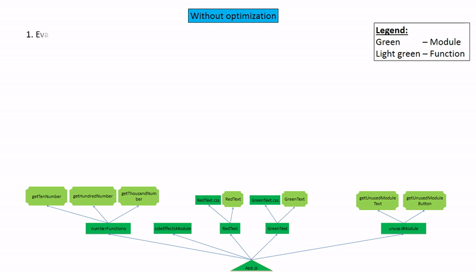
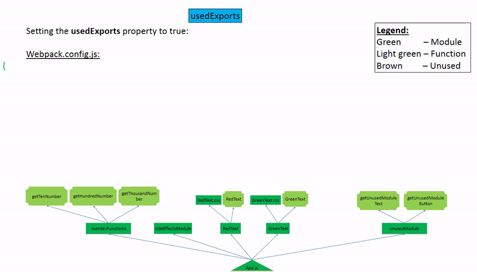
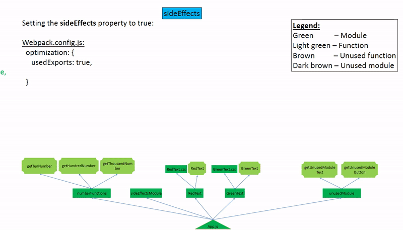
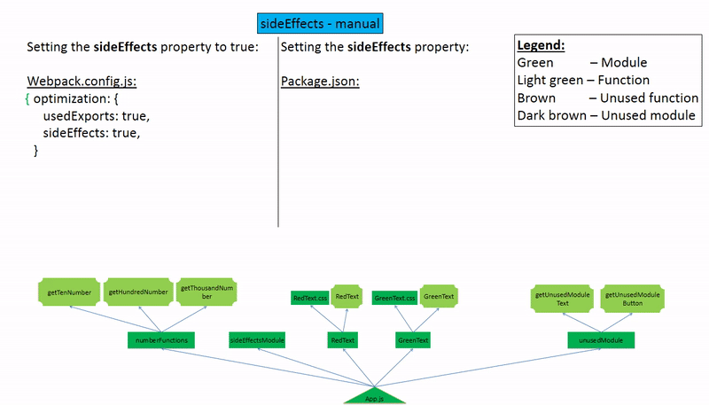
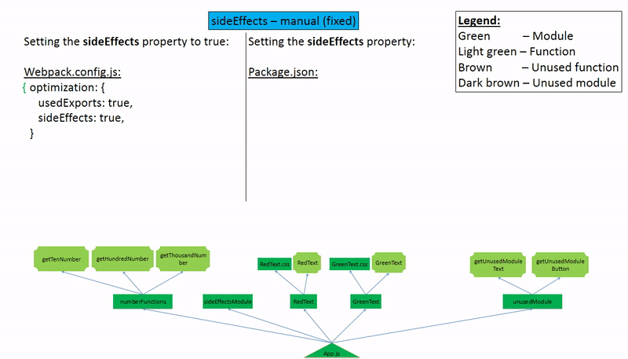
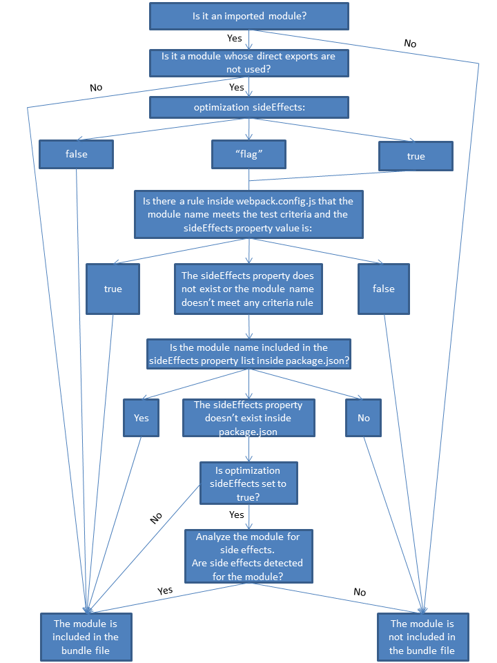
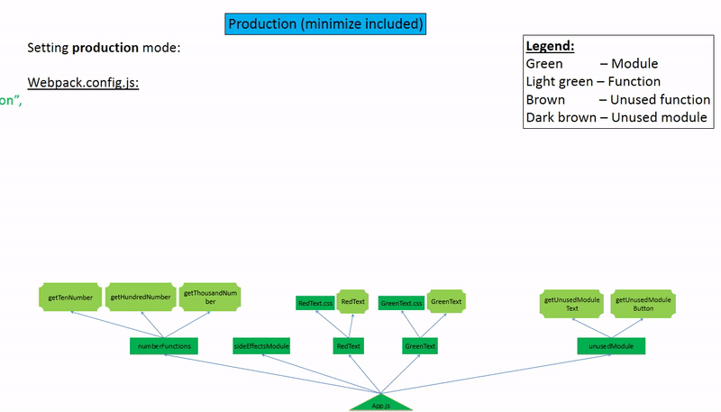
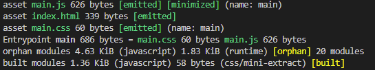

# Tree shaking in Webpack

## Table of Contents

- [Introduction](#introduction)
- [TL;DR](#tldr)
- [Webpack](#webpack)
  - [Bundle Javascript project (development mode)](#bundle-javascript-project-development-mode)
- [Tree Shaking](#tree-shaking)
  - [Optimization](#optimization)
    - [usedExports](#usedexports)
    - [sideEffects](#sideeffects)
    - [Production mode](#production-mode)
  - [Tree shaking summary steps](#tree-shaking-summary-steps)
  - [Dynamic imports](#dynamic-imports)
- [Summary](#summary)

## Introduction

Javascript file size can have a significant impact on browser performance. Unused code increases the size of our bundle file and as a result causes performance issues.

> Delivering less JavaScript can mean less time in network transmission, less spent decompressing code and less time parsing and compiling this JavaScript - Addy Osmani

One effective way to reduce Javascript file size is through tree shaking.

Tree shaking is a term commonly used in the context of Javascript module bundlers. It refers to the process of removing unused code from the final bundle.

It is a powerful feature that can help you optimize the size of your Javascript bundle files. Despite its usefulness, many developers are still unfamiliar with how it works and how to use it effectively. After researching the topic and encountering some common issues, I decided to write a comprehensive guide to tree shaking in Webpack.

In this article, we'll explore how tree shaking works in Webpack and how you can use it to optimize your code. Through examples and visualizations, we'll explain the process of tree shaking step by step and help you optimize your code for better performance.

## TL;DR

When building a production bundle in Webpack, the tree shaking process occurs automatically. The optimization properties of usedExports and sideEffects are enabled by default, leading to automatic optimization of the bundle files. 

The main purpose of manually configuring sideEffects is to eliminate unused reexported modules within barrel files, resulting in a significant reduction in bundle size, improving performance and loading times.

## Webpack

Webpack's main role is to bundle all module files into one or several files and minimize their size to save time and reduce server requests. Typically, we provide one entry point (the main Javascript file) to the Webpack config and then bundle files are created.

When executing regular Javascript (non-bundled), ES Modules evaluate every imported module file even if the imported specifier of the module is not used because the module can have side effects.

According to [ECMA spec](http://www.ecma-international.org/ecma-262/6.0/#table-37):

> Do nothing if this module has already been evaluated. Otherwise, transitively **evaluate all module dependences of this module and then evaluate this module**

To resemble the behavior of ES Modules, Webpack includes every imported module's code (a dependency) in the bundle file without any elimination of code (except for optimization features).

### Bundle Javascript project (development mode)

Let's create an example of regular Webpack bundle files without optimization.

In this example, we'll demonstrate how webpack bundles different files types (JS/CSS) into one file type [main.js](examples/1-without-optimization/dist/main.js) and [main.css](examples/1-without-optimization/dist/main.css).

We'll use development mode because it does not have any optimizations configured by default.

To see the differences between different mode configurations (production/development/other) you can refer to the [defaults.js](https://github.com/webpack/webpack/blob/main/lib/config/defaults.js) file.

<details><summary><strong>Or expand relevant optimization section in <code>defaults.js</code></strong></code></summary>

```js
//...
const applyOptimizationDefaults = (
	optimization,
	{ production, development, css, records }
) => {
	D(optimization, "removeAvailableModules", false);
	D(optimization, "removeEmptyChunks", true);
	D(optimization, "mergeDuplicateChunks", true);
	D(optimization, "flagIncludedChunks", production);
	F(optimization, "moduleIds", () => {
		if (production) return "deterministic";
		if (development) return "named";
		return "natural";
	});
	F(optimization, "chunkIds", () => {
		if (production) return "deterministic";
		if (development) return "named";
		return "natural";
	});
	F(optimization, "sideEffects", () => (production ? true : "flag"));
	D(optimization, "providedExports", true);
	D(optimization, "usedExports", production);
	D(optimization, "innerGraph", production);
	D(optimization, "mangleExports", production);
	D(optimization, "concatenateModules", production);
	D(optimization, "runtimeChunk", false);
	D(optimization, "emitOnErrors", !production);
	D(optimization, "checkWasmTypes", production);
	D(optimization, "mangleWasmImports", false);
	D(optimization, "portableRecords", records);
	D(optimization, "realContentHash", production);
	D(optimization, "minimize", production);
	A(optimization, "minimizer", () => [
		{
			apply: compiler => {
				// Lazy load the Terser plugin
				const TerserPlugin = require("terser-webpack-plugin");
				new TerserPlugin({
					terserOptions: {
						compress: {
							passes: 2
						}
					}
				}).apply(compiler);
			}
		}
	]);
	F(optimization, "nodeEnv", () => {
		if (production) return "production";
		if (development) return "development";
		return false;
	});
//...
```

</details>
    
Let's take a look at the Webpack configuration:

_[webpack.config.js](examples/1-without-optimization/webpack.config.js)_

```js
//...
module.exports = {
  mode: "development",
//...

}
```

Before we run the webpack command, let's take a look at our code:

_[App.js](examples/1-Without-optimization/src/App.js)_

```jsx
import { GreenText } from "./components/Texts/GreenText/GreenText";
import { RedText } from "./components/Texts/RedText/RedText";
import { getHundredNumber } from "./tools/numberFunctions/numberFunctions";
import { getUnusedModuleText } from "./tools/unusedModule/unusedModule";
import "./tools/sideEffectsModule/sideEffectsModule";

function App() {
  const hundredNumber = getHundredNumber();
  return (
    <>
      <GreenText>Number in green: {hundredNumber}</GreenText>
      <RedText>Text in red</RedText>
    </>
  );
}

export default App;
```


From the code above, we can see that we have `GreenText` and `RedText` components, the `getHundredNumber` function and the `sideEffectsModule` module in `App.js`. We also import an unused function `getUnusedModuleText`. These components, functions and module use different modules through direct import:
<br>

1. The component `GreenText` is from the module `"./components/Texts/GreenText/GreenText`.
2. The component `RedText` is from the module `"./components/Texts/RedText/RedText"`.
3. The function `getHundredNumber` is from the module `"./tools/numberFunctions/numberFunctions"`, which contains another two functions (`getTenNumber`, `getThousandNumber`).
4. the unused function `getUnusedModuleText` is from the module `"./tools/unusedModule/unusedModule"`, which contains another function (`getUnusedModuleButton`).
5. A side effect import module that is imported from `"./tools/sideEffectsModule/sideEffectsModule"`, which contains global code with side effects.

In the bundle process we expect that it will produce two files (JS and CSS files).
<br>
Let's run `npx webpack` in the terminal window.
<br>
The build process created two files as expected: `main.js` and `main.css`.

Let's demonstrate it in a dependency tree:



In the [main.js](examples/1-without-optimization/dist/main.js) file, we can see that all functions and global code from all imported modules are included in the file. Even functions that weren't imported as a specifier in the import statement are included in the bundle file. As we mentioned earlier, Webpack resembles the behavior of ES Modules by importing the entire code of modules including unused code (dead code).

Even the following unused functions are included:

1. The unused function `getUnusedModuleButton` from the unused module `./tools/unusedModule/unusedModule`.
2. The unused functions `getTenNumber` and `getThousandNumber` from the used module `./tools/numberFunctions/numberFunctions`.

**Note:** The `BlueText` and `BlackText` are not included because they haven't been imported anywhere.

When importing from a re-exported module, for example, a barrel file, Webpack will evaluate all re-exported modules as having side effects even if some of the re-exported modules aren't imported or used. The reason for this is written in the official Webpack [example of side effects](https://github.com/webpack/webpack/tree/main/examples/side-effects):

> According to the EcmaScript spec, all child modules must be evaluated because they could contain side effects.

Sean from the Webpack team also explained this on [Stack Overflow](https://stackoverflow.com/a/49203452):

> According to the ECMA Module Spec, whenever a module re-exports all exports, (regardless if used or unused) they need to be evaluated and executed in case one of those exports created a side-effect with another.

The used and unused functions are marked in the `main.js` bundle file by the comment `"harmony export"`.

These unused functions (also known as dead code) increase the size of our bundle file and cause performance issues.

To improve performance, we prefer to carefully delete unused code and make our bundle file as small as possible.

In the [main.css](examples/1-without-optimization/dist/main.css) file, we can see both class selectors of `.GreenText` and `.RedText`.

The term for dead code elimination is called __Tree shaking__ and we will discuss it in the next chapter.

## Tree Shaking

During the build process, Webpack creates a dependency tree structure. In the tree, each dependency (module) is represented by a branch and each function is represented by a leaf. There are green branches (which represent modules with used functions or with side effects), light green leaves (which represent imported used functions), brown leaves (which represent unused functions from imported module, also known as "dead code") and dark brown branches (which represent imported unused modules with no side effects). When we shake the tree, the brown leaves should fall off while the green leaves remain. In our case, this means that after tree shaking only imported used functions or modules with used functions or side effects should remain.

As we saw in the last example, used and unused functions were marked the same with the comment `"harmony export"` that specifies the green leaves.
<br>
How can it be that unused functions were marked as green leaves? Because we were in development mode, which has no optimization enabled.
<br>
So how can we mark the unused functions as brown leaves and unused modules without side effects as dark brown branches? For this, we should use the optimization configuration.

### Optimization

#### usedExports

The `usedExports` property is responsible for marking the unused functions with brown leaves.
<br>
Let's clone the previous example `1-without-optimization` to `2-optimization-usedExports` and change the Webpack config file as follows:

_[webpack.config.js](examples/2-optimization-usedExports/webpack.config.js)_

```diff
//...
module.exports = {
  mode: "development",
+ optimization: {
+   usedExports: true,
+ },
//...
}
```

Now run `npx webpack` in the terminal window.

Let's demonstrate it in a dependency tree:



Take a look at the bundle file:

_[main.js](examples/2-usedExports-enabled/dist/main.js)_

```javascript
//...
/* unused harmony exports getTenNumber, getThousandNumber */
function getTenNumber() {
  return 10;
}
function getHundredNumber() {
  return 100;
}
function getThousandNumber() {
  return 1000;
}
//...
/* unused harmony exports getUnusedModuleText, getUnusedModuleButton */
function getUnusedModuleText() {
  return "imported but unused module";
}
function getUnusedModuleButton() {
  return "imported but unused module";
}
```

In the [main.js](examples/2-usedExports-enabled/dist/main.js) file we can see that Webpack with the `usedExports: true` property marked the unused functions (dead code) with the comment `/* unused harmony export functionName */`. This comment points to the unused function as a brown leaf in the tree.

But the entire unused function declarations are still in the file. How can we get rid of it? How can we shake the tree and cause brown leaves to fall down (eliminate dead code) to the ground? We will shake the tree later using either the configuration of `minimize: true` or `mode: production` .

In the [main.css](examples/2-usedExports-enabled/dist/main.css) file, we can see that it's the same as in the first example `1-without-optimization`.

#### sideEffects

First, let's explain what side effects are.

There are two types of code: pure code and code with side effects:

1. **Pure code**: It uses only variables from its scope and doesn't use global variables like the `window` object or data that comes from the outside sources such as HTTP requests, file system, DOM, etc. <br>
   For example, a pure function always returns the same output for the same input and doesn't use global variables. In short, pure code is a code without side effects.
3. **Code with side effects**: It uses global variables or data from outside its scope. For example, a function that can return different output for the same input or a function that changes global variables like the `window` object or uses data from HTTP calls, file system, DOM, etc. In short, It is the opposite of pure code.

In Webpack, `sideEffects` configuration enables us to exclude entire module (and his dependencies) whose direct exports are not used and doesn't have side effects from the bundle file.

**Point to remember to this section: In Webpack, the `sideEffects` configuration only affects imported modules whose direct exports are not used. Modules with used exports will always be included. An example of imported modules whose direct exports are not used are barrel files that re-export functions.**

There are two configurations for `sideEffects` that are designed to work together if they configured:
1. The `sideEffects` property in the `optimization` object in `webpack.config.js` - Enable the use for manual configuration of modules with or without side effects and/or automatic analysis of modules for side effects.
2. The manual `sideEffects` property inside either `package.json` file or the `module.rules` array in the `webpack.config.js` file - Manually configure the list of modules that have or don't have side effects. In this case modules whose direct exports are not used flagged manually as having no side effects, then these modules and their dependencies will be safely excluded from the bundle file without even being evaluated.

**sideEffects optimization**

According to [WebpackOptions.json](https://github.com/webpack/webpack/blob/eac5d8cacb8a33914d7abf74ee76b51bb087217e/schemas/WebpackOptions.json), the optimization `sideEffects` property can have the following values:

1. `true` - Include or exclude modules depending on their manual configuration in the `package.json` or `webpack.config.js` file. Modules that haven't been flagged with or without side effects in the `webpack.config.js` file and whose exports are not used will be analyzed, if there are no side effects, they will be excluded.
2. `"flag"` - Only include or exclude modules depending on their manual configuration in the `package.json` or `webpack.config.js` file. Modules that haven't been flagged with or without side effects in the `webpack.config.js` file will be included as usual, just like we learned about ES modules.
3. `false` - It will not evaluate modules for side effects even if set in the `package.json` or `webpack.config.js` file. All imported modules will be included as we learned about ES modules.

**Note**

If the modules with side effects are flagged in the `package.json` file, the remaining files will be flagged as having no side effects. So if modules are configured through the `package.json` file, there will be no difference between the values `true` and `"flag"`. The result of them will be the same because all modules are flagged with or without side effects and there is no module that isn't flagged. Then the `true` value will not have modules to analyze because all modules have been flagged with or without side effects, so `true` and `"flag"` will have the same behavior. <br>
Production mode uses the optimization `sideEffects` value of `true`.

Before we dive into the manual way of configuring sideEffects, let's make an example about the optimization `sideEffects` property without manually defining which modules have or don't have side effects:

Clone the previous example `2-optimization-usedExports` to `3-optimization-sideEffects` and change the webpack config file as follows:

_[webpack.config.js](examples/3-optimization-sideEffects/webpack.config.js)_

```diff
//...
module.exports = {
  mode: "development",
 optimization: {
   usedExports: true,
+  sideEffects: true,
 },
//...
}
```

Now run `npx webpack` in the terminal window.

Let's demonstrate it in a dependency tree:



Take a look at the bundle file:

_[main.js](examples/3-optimization-sideEffects/dist/main.js)_

```javascript
//...
/* unused harmony exports getTenNumber, getThousandNumber */
function getTenNumber() {
  return 10;
}
function getHundredNumber() {
  return 100;
}
function getThousandNumber() {
  return 1000;
}
//...
```

In the [main.js](examples/3-optimization-sideEffects/dist/main.js) file, we can see that Webpack with the `sideEffects: true` property eliminates the unused module of `unusedModule` (dead code) compared to the previous example `2-optimization-usedExports` which just marked `unusedModule` with `/* unused harmony export getUnusedModuleText, getUnusedModuleButton */`. When we use in `mode: production`, which under the hood uses `minimize: true`, for both the second and third examples, both bundle files will be the same because the unused `unusedModule` will be eliminated during the minimizing process.

In the [main.css](examples/3-optimization-sideEffects/dist/main.css) file, we can see that it's the same as in the first example `1-without-optimization`.

**sideEffects - Manually define**

Now, if we set the optimization `sideEffects` property to `true` or `"flag"`, we can help Webpack manually define which modules have side effects and which don't.

Sean from the Webpack team explains on [Stack Overflow](https://stackoverflow.com/questions/49160752/what-does-webpack-4-expect-from-a-package-with-sideeffects-false) that we use the `sideEffects` configuration as a way to save on both compile time and build size because it excludes modules in advance that are flagged as having no side effects and whose direct exports are not used.

According to Webpack [documentation](https://webpack.js.org/guides/tree-shaking/#clarifying-tree-shaking-and-sideeffects):

> `sideEffects` is much more effective since it allows to skip whole modules/files and the complete subtree.

> `usedExports` relies on Terser to detect side effects in statements. It is a difficult task in JavaScript and not as effective as straightforward `sideEffects` flag.

Webpack's team talked about another purpose of the manual `sideEffects` property in their [conference](https://youtu.be/bm7RlNEcQM0?t=1761) and explained that it comes to solve the issue of big bundle files when using of barrel files.

There are 2 ways to manually define which modules have side effects and which don't:

1. Package config file (`package.json`):

    All package modules have no side effects:

    ```json
    {
      "name": "example-module",
      "sideEffects": false
    }
    ```
    
    Alternatively, an array of modules that have side effects (the remaining modules will be considered and flagged as having no side effects if they don't have used direct exports):

    
    ```json
    {
      "name": "example-module",
      "sideEffects": ["*.css", "*.scss"]
    }
    ```
    
2. Webpack config file (`webpack.config.js`):

    Use regular expressions to define all Javascript and Typescript files in the project as having no side effects and CSS files as having side effects:
	
    ```javascript
    module: {
      rules: [
        {
          test: /\.(js|mjs|jsx|ts|tsx)$/,
          sideEffects: false
        },
        {
          test: /\.s?css$/,
          sideEffects: true
        }
      ]
    }
    ```

We know that CSS files are considered to have side effects, so we flag them as such. However, this is not mandatory and we can remove the rule for CSS files above. The result will be the same, it's just for protection. if someone later configures the `package.json` file with `sideEffects: false`, the rule in `webpack.config.js` for CSS will override the configuration in `package.json`

Webpack wrote a "Tip" about CSS files as described on [Webpack website](https://webpack.js.org/guides/tree-shaking/#mark-the-file-as-side-effect-free):

    > Note that any imported file is subject to tree shaking. This means if you use something like css-loader in your project and import a CSS file, it needs to be added to the side effect list so it will not be unintentionally dropped in production mode.

**Side effect import - `import "filename.js"`**

In [Side effect import](https://developer.mozilla.org/en-US/docs/Web/JavaScript/Reference/Statements/import#import_a_module_for_its_side_effects_only) also called "Empty import", It will need to be included if there are side effects inside it. This can include, for example, global code and CSS files.

```javascript
import "filename.js";
import "filename.css";
```

In our examples, we use a module with side effects called `sideEffectsModule`. Note that this module has no exports but have side effects cause it affects `window` object. So this kind of module can easily be excluded from the bundle file if it is configured incorrectly and not included in the array of the `sideEffects` property in the `package.json` file.

So let's make a manual configuration of `sideEffects` in the `package.json` file.

Let's clone the previous example `3-optimization-sideEffects` to `4-package-sideEffects` and change the package config file as follows:

_[package.json](examples/4-package-sideEffects/package.json)_

```diff
{
  "name": "example-module",
+ "sideEffects": ["*.css"],
}
```

Alternatively:

_webpack.config.js_

```diff
module: {
  rules: [
    {
      test: /\.(js|mjs|jsx|ts|tsx)$/,
+     sideEffects: false
    }
  ]
}
```

In our example we use only the `package.json` option, but both options have the same result.

Now run `npx webpack` in the terminal window.

Let's demonstrate it in a dependency tree:



In the [main.js](examples/4-package-sideEffects/dist/main.js) file, we can see that it is similar to the previous example (3-optimization-sideEffects) except that the content of `sideEffectsModule` is not included. This occurred because `sideEffectsModule` doesn't have any exports and was flagged as having no side effects. As a result, Webpack doesn't evaluate it for side effects and simply skips over the `sideEffectsModule` module.

In the [main.css](examples/4-package-sideEffects/dist/main.css) file, we can see that it's the same as in the first example (1-without-optimization).

So what are the differences between the third and fourth examples except the missing global code of `sideEffectsModule` module? It's about compile time, as we talked earlier about Sean from the Webpack team. In the fourth example, Webpack skips over modules with unused exports that have been flagged as having no side effects without attempting to evalute them for side effects.

**sideEffects - Manually define fixed**

Let's make the same example but this time we will correctly configure the `package.json` file.

_[package.json](examples/5-package-sideEffects-fixed/package.json)_

```diff
{
  "name": "example-module",
- "sideEffects": ["*.css"],
+ "sideEffects": ["*.css", "sideEffectsModule.js"],
}
```

Now run `npx webpack` in the terminal window.

Let's demonstrate it in a dependency tree:



In the [main.js](examples/5-package-sideEffects-fixed/dist/main.js) file, we can see that now it fixed and `sideEffectsModule` module content is included in the bundle file.

**Note - Manually configuring sideEffects issue**

I found an [issue](https://github.com/webpack/webpack/issues/10413) where __Hypnosphi__ complained that there were differences between development and production when he configured `sideEffects: false`. He noticed that the order of CSS was not the order of the imports but the usage order. In another [issue](https://github.com/webpack/webpack/issues/7094#issuecomment-383466978) there is an answer from sokra (a Webpack team member) who wrote:
> Technically using sideEffects you say order doesn't matter

Another answer of [sokra](https://github.com/webpack/webpack/issues/7094#issuecomment-945663737):

> If the order of some modules matter they are not side-effect-free.

I will expand on this in the article *Potential issues with barrel files in Webpack* talking about issues with optimization configuration and how to solve them.

If I only import the modules that I use, why should I use the `sideEffects` property? It's useful for modules that only re-exports functions from other modules. For example, barrel files that are used inside modules that are dynamically imported. I will expand on this in my next article.

**Summarize the `sideEffects` configuration in a diagram:**



#### Production mode

The last thing that remains to check is the production bundle.

Production mode has different optimization values compared to development mode. We can see in the [default.js](https://github.com/webpack/webpack/blob/main/lib/config/defaults.js) file that `minimize` is set to true.

The `minimize` property is used as the final tree shaking step. It eliminates unused exports (brown leaves) that were marked by `usedExports`.

Let's clone the third example `3-optimization-sideEffects` to `6 - production` and change the webpack config file as follows:

_[webpack.config.js](examples/6-production/webpack.config.js)_

```diff
  //...
  module.exports = {
+   mode: "production",
-   mode: "development",
-   optimization: {
-     usedExports: true,
-     sideEffects: true,
-   },
//...
  }
```

Now run `npx webpack` in the terminal window.

Let's demonstrate it in a dependency tree:



In the [main.js](examples/6-production/dist/main.js) file, we can see that it's significantly smaller file. It only includes what's needed and mangles the variable and function names.
<br>

In the [main.css](examples/6-production/dist/main.css) file, we can see that it has changed here because it eliminated comments in the file compared to previous examples.

After optimizing and minifying our bundle file, let's take a look at the results.



As shown in the screenshot, the size of the JS files has decreased significantly - from 1.36kb to 626 bytes, a reduction of 54%. This is a substantial decrease in size.

### Tree shaking summary steps

1. Eliminating imported modules whose direct exports are not used and don't have side effects with `sideEffects` configuration.
2. Mark the brown leaves (comment: `/* unused harmony export functionName */`) with the `usedExports: true` property.
3. Shake the tree (eliminate dead code) with the `minimize: true` or `mode: production` property.

### Dynamic imports

This article will not cover the topic of tree shaking *dynamic imports*. For an in-depth explanation of this subject, please refer to the awesome article [*Dynamically Import ESModules and Tree Shake them too!*](https://blog.hotstar.com/how-to-dynamically-import-esmodules-and-tree-shake-them-too-aa24ee4885f5).

## Summary

In this article, we explored the concept of tree shaking in Webpack to optimize your bundle file. We explained how tree shaking can be used to remove unused functions and modules (dead code) from the final bundle and which optimization properties involved in that through examples and visualizations. The main purpose of this article was to ease the tree shaking subject and I hope that I succeeded in that.

I recommend reading my next article on *Potential issues with barrel files in Webpack*.


**Additional Resources:**

[Reduce JavaScript payloads with tree shaking](https://web.dev/reduce-javascript-payloads-with-tree-shaking/)

[Tree Shaking in official Webpack website](https://webpack.js.org/guides/tree-shaking/)

[Deep Dive Into Tree-Shaking](https://javascript.plainenglish.io/deep-dive-into-tree-shaking-ba2e648b8dcb)

[How to build tree-shakeable JavaScript libraries](https://cube.dev/blog/how-to-build-tree-shakeable-javascript-libraries)

[JavaScript Start-up Optimization](https://web.dev/optimizing-content-efficiency-javascript-startup-optimization/)
